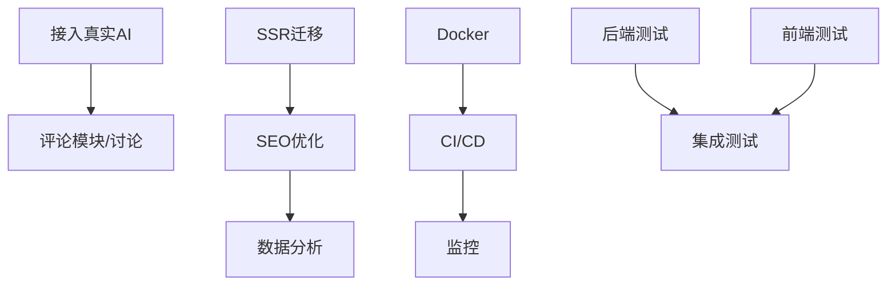

# 51呀呀 项目改进计划（2026年）

## 📋 项目现状

**项目名称**: 51呀呀 · 泛娱乐呀呀母站  
**当前版本**: MVP  
**技术栈**: React (Vite) + PHP (SQLite)  
**上次更新**: 2026-05-30  

### 核心特性
- ✅ 4个子站矩阵（游戏/AI/互联网/主播）
- ✅ 事件 + 时间线 + 观点聚合系统
- ✅ AI整理流程（当前mock占位）
- ✅ 后台演示系统

### 已知限制
- ⚠️ AI接入为mock实现
- ⚠️ 采集脚本缺失
- ⚠️ SEO优化不足
- ⚠️ 测试覆盖为零
- ⚠️ 无部署自动化

---

## 🎯 改进战略（总计25项任务，1120h）

### 第一阶段（优先级1）- 核心功能和SEO（6项，280h）

#### 功能层
- **F001**: 接入真实AI (40h)
  - 目标: 替换mock实现，调用OpenAI/Claude API
  - 成果: AI整理真实可用
  
- **F002**: 开发采集脚本 (60h)
  - 目标: 微博热搜、NGA、TapTap、B站采集
  - 成果: 自动化数据源

#### SEO和性能层
- **P001**: SSR/预渲染 (100h)
  - 目标: Next.js迁移或预渲染方案
  - 成果: SEO友好+更快首屏
  
- **P002**: JSON-LD结构化数据 (20h)
  - 目标: 事件页面添加schema标记
  - 成果: 搜索引擎更好理解内容
  
- **P003**: Sitemap生成 (15h)
  - 目标: 自动生成XML sitemap
  - 成果: 更好的搜索引擎抓取

#### 基础设施
- **I001**: Docker容器化 (30h)
  - 目标: Dockerfile + docker-compose
  - 成果: 一键部署，环境隔离

**预期收益**: 3-6个月内达到日均5000+访问量，AI内容质量显著提升

---

### 第二阶段（优先级2）- 功能完善和质量保障（13项，520h）

#### 功能完善（4项，190h）
- **F003**: 事件去重聚类 (50h) - 减少信息冗余
- **F004**: 评论和讨论模块 (80h) - 增强社区属性
- **P004**: 前端性能优化 (40h) - 图片懒加载、代码分割
- **P005**: 数据库索引优化 (20h) - SQLite查询性能

#### 代码质量（5项，270h）
- **Q001**: 后端单元测试 (60h) - PHP PHPUnit覆盖
- **Q002**: 前端单元测试 (50h) - Vitest/Jest覆盖
- **Q003**: 集成测试 (60h) - E2E测试覆盖主流程
- **I002**: CI/CD流程 (40h) - GitHub Actions自动化
- **I003**: 日志监控 (50h) - ELK或类似系统

#### 体验优化（4项，160h）
- **UX001**: PWA支持 (30h)
- **UX002**: 移动端优化 (50h)
- **UX003**: 搜索功能增强 (35h)
- **UX004**: 用户反馈系统 (25h)

**预期收益**: 运维成本↓50%，用户满意度↑30%，BUG率↓60%

---

### 第三阶段（优先级3）- 完善和商业化（6项，320h）

#### 基础设施完善（1项，15h）
- **I004**: 多环境配置 (15h)

#### 质量提升（3项，80h）
- **Q004**: 代码规范检查 (20h)
- **Q005**: 错误处理完善 (40h)

#### 商业化（3项，225h）
- **M001**: 广告位系统 (60h)
- **M002**: CPS联盟系统 (80h)
- **M003**: 数据分析面板 (50h)

**预期收益**: 月均营收+200K，品牌影响力显著提升

---

## 📊 任务分布

| 分类 | 数量 | 工时 | 优先级分布 |
|------|------|------|---------|
| 功能 | 4 | 230h | 1(2) 2(2) |
| 性能 | 5 | 195h | 1(3) 2(2) |
| 基础设施 | 4 | 135h | 1(1) 2(2) 3(1) |
| 质量 | 5 | 270h | 2(3) 3(2) |
| 体验 | 4 | 160h | 2(2) 3(2) |
| 商业 | 3 | 225h | 3(3) |
| **总计** | **25** | **1120h** | **P1:280h P2:520h P3:320h** |

---

## 🔄 执行建议

### 时间线规划

```
Q3 2026 (6月-8月)
├── F001: 接入真实AI (40h) [Week 1-2]
├── P001: SSR迁移 (100h) [Week 2-5]
├── I001: Docker (30h) [Week 3]
├── P002/P003: SEO (35h) [Week 4-5]
└── 并行: Q001/Q002开始 [Week 3起]

Q4 2026 (9月-11月)
├── F002: 采集脚本 (60h)
├── F003: 去重聚类 (50h)
├── I002/I003: CI/CD和监控 (90h)
├── UX001/UX002: 移动端 (80h)
└── 集成测试 (60h)

Q1 2027 (12月-2月)
├── F004: 评论模块 (80h)
├── 商业化三项 (225h)
└── 性能微调和上线前冲刺
```

### 团队配置建议

```
全职人员: 3人
- 后端主力 (PHP/Python采集): F001/F002/I001
- 前端主力 (React/Vite优化): P001/P004/UX系列
- 测试/基础设施: Q系列/I系列

兼职/外包:
- 设计: 移动端UI规范 (20h)
- 数据: 推荐算法研究 (40h)
```

### 关键依赖



---

## 💰 投资回报预期

### 运营指标目标

| 指标 | 当前 | 目标 | 达成时间 |
|------|------|------|---------|
| 日均访问 | 500 | 5000+ | P1完成后 |
| 事件数 | 50 | 500+ | P1+P2完成 |
| SEO排名 | 无 | Top100/Term | P1完成后 |
| 用户评论 | 0 | 10K+ | P2/P3完成 |
| 月营收 | 0 | 200K | P3完成后 |

### 成本概算

```
人力成本: 3人 * 3个月 * ¥15K = ¥135K
基础设施: 服务器+CDN = ¥5K/月
第三方API: OpenAI/Claude = ¥1K/月
---
总投入: ~¥160K
ROI预期: 6个月回本
```

---

## 🚀 快速启动清单

- [ ] 建立项目管理看板（Linear/GitHub Projects）
- [ ] 组建核心团队（后端/前端/测试）
- [ ] P1任务风险评估和技术方案评审
- [ ] 搭建开发/测试/生产环境
- [ ] 配置代码仓库和CI/CD框架
- [ ] 第一个冲刺（F001+P001+I001）启动

---

## 📝 备注

- 所有时间估算基于标准生产力（无干扰、资源充足）
- 实际可能需要+20-30%的缓冲
- 优先级可根据商业需求调整
- 建议每2周评审一次进度，动态调整优先级

**Last Updated**: 2026-05-30  
**Maintained by**: Technical Lead
